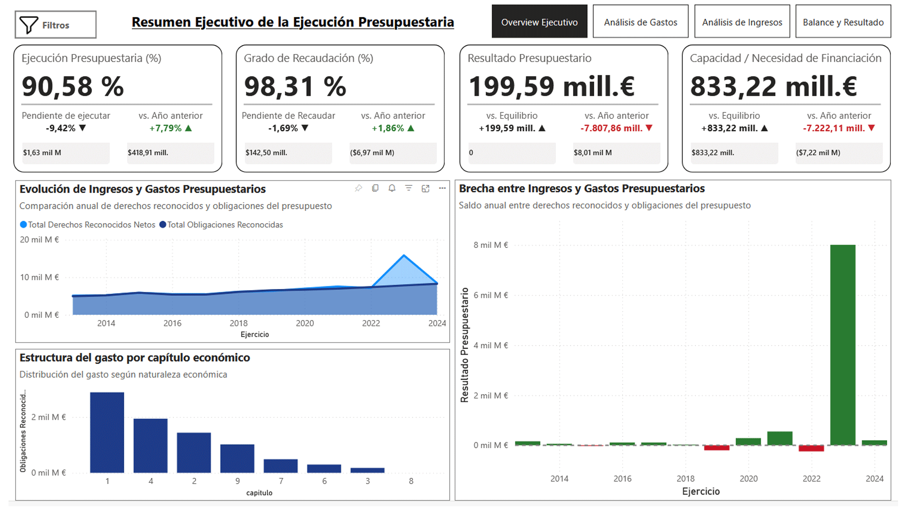
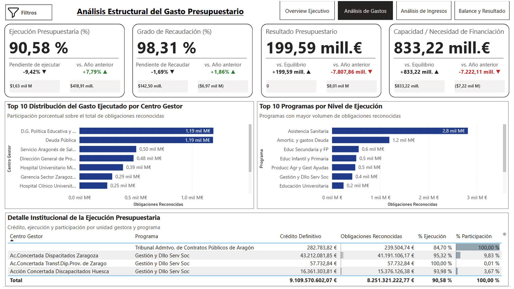
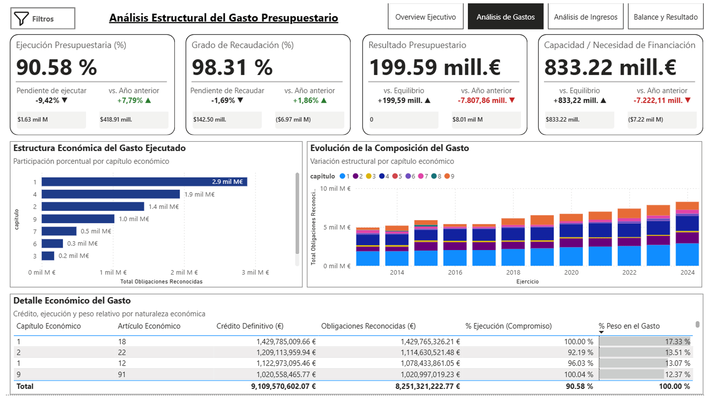
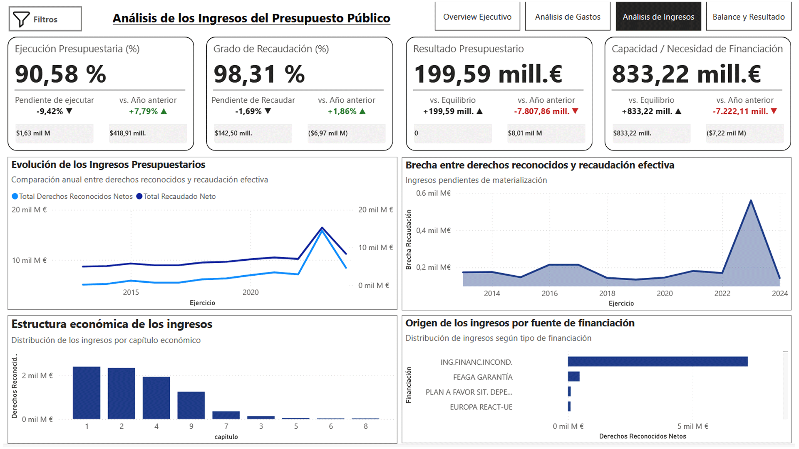
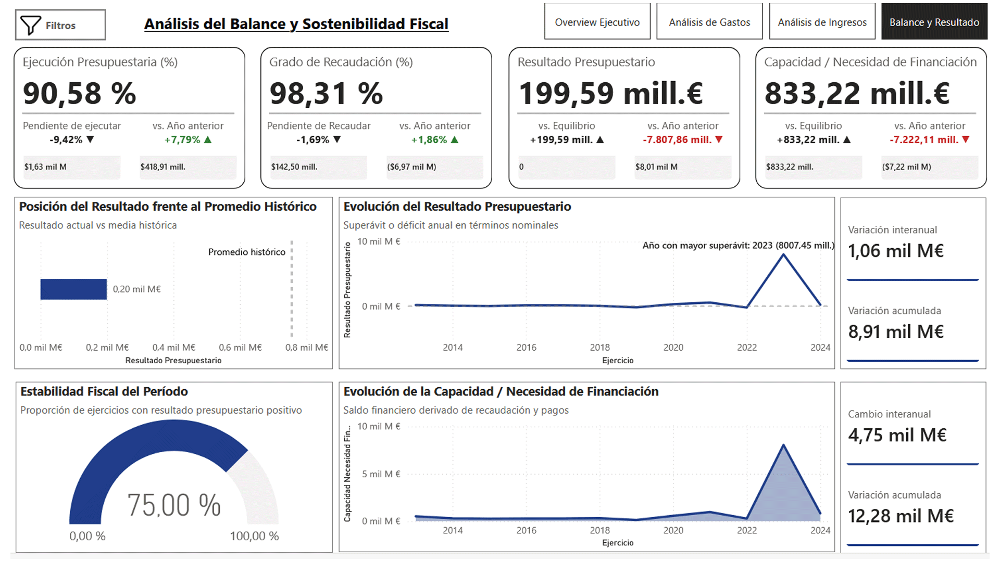
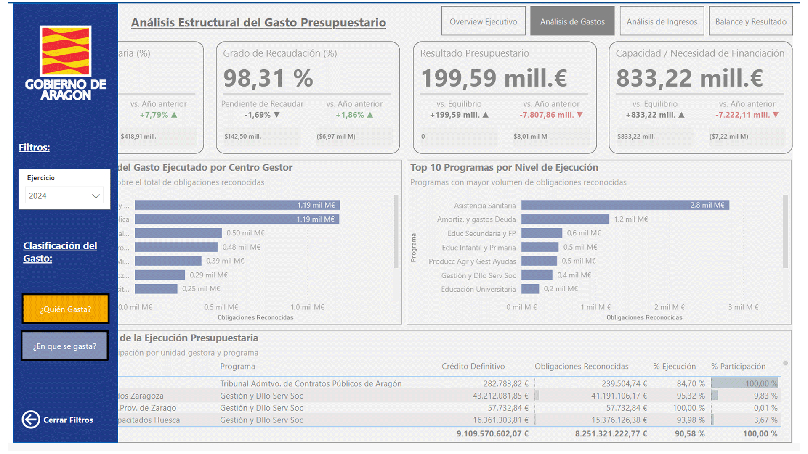

# Dashboard de Ejecución Presupuestaria - Aragón (2013-2024)

## 📊 Descripción del Proyecto

Proyecto de **Business Intelligence con Power BI** enfocado en el análisis de la ejecución presupuestaria del Gobierno de Aragón utilizando datos abiertos oficiales (2013-2024).

El objetivo es construir un dashboard estratégico que permita analizar:

- Ejecución de **gastos públicos**.
- Evolución de **ingresos**.
- Clasificación presupuestaria completa (económica, funcional, orgánica y financiación).
- Tendencias financieras y sostenibilidad fiscal del presupuesto público.

Los datos provienen del portal **Aragón Open Data** y se trabajan bajo un enfoque de **modelo estrella (Star Schema)** para facilitar análisis multidimensional y visualización estratégica.

---

# 📊 Vista General del Dashboard

## Overview Ejecutivo

Panel de control principal que resume el estado general de la ejecución presupuestaria mediante indicadores clave:

- % de ejecución presupuestaria
- grado de recaudación
- resultado presupuestario
- capacidad o necesidad de financiación

Además se muestran tendencias generales de ingresos y gastos y la distribución del gasto por capítulo económico.

---

# 📉 Análisis del Gasto Público

## ¿Quién gasta?

Este análisis permite identificar **qué instituciones o centros gestores concentran mayor volumen de gasto público**.

Incluye:

- Top 10 centros gestores por obligaciones reconocidas
- ranking de programas con mayor ejecución
- detalle institucional del gasto ejecutado

Esto permite identificar **prioridades administrativas y áreas de mayor impacto presupuestario**.

---

## ¿En qué se gasta?

Análisis estructural del gasto desde la **clasificación económica** del presupuesto:

- participación por capítulo económico
- evolución de la composición del gasto a lo largo del tiempo
- peso relativo de cada tipo de gasto público

Este análisis permite entender **la estructura del gasto público** (personal, transferencias, inversiones, etc.).

---

# 📈 Análisis de Ingresos Públicos

Permite analizar cómo evolucionan los ingresos del gobierno regional y qué tan eficientemente se materializan.

Incluye:

- evolución anual de ingresos reconocidos vs recaudados
- brecha entre derechos reconocidos y recaudación efectiva
- estructura económica de los ingresos
- origen de los ingresos por fuente de financiación

Esto permite evaluar **la sostenibilidad de los ingresos públicos y su capacidad de financiar el gasto**.

---

# ⚖️ Balance y Sostenibilidad Fiscal

Este panel analiza el **resultado presupuestario del gobierno**.

Incluye:

- evolución histórica del resultado presupuestario
- comparación frente al promedio histórico
- estabilidad fiscal del periodo
- evolución de la capacidad o necesidad de financiación

Esto permite analizar si el presupuesto presenta **superávit o déficit estructural**.

---

# 🎛️ Panel de Filtros Interactivos

El dashboard incorpora un **panel lateral interactivo de filtros** que permite:

- seleccionar el ejercicio presupuestario
- cambiar el enfoque del análisis
- explorar el gasto por clasificación institucional o económica

Este panel se activa mediante **bookmarks y botones interactivos**, mejorando la experiencia de usuario.

---

# 📂 Estructura del Repositorio
- data/
- raw/ → Archivos CSV originales
- docs/ → Documentación del proyecto
- img/ → Capturas del dashboard e iconos
- reports/ → Archivos Power BI (.pbip)
- scratch/ → Borradores de análisis

Los archivos de datos provienen del portal **Aragón Open Data**.

---

# 🛠️ Proceso ETL y Preparación de Datos

Durante el desarrollo del proyecto se realizaron diversas transformaciones:

- Normalización de **formatos numéricos europeos**
- Consolidación de **múltiples ejercicios presupuestarios**
- Creación de **tablas de hechos unificadas**
- Construcción de **dimensiones presupuestarias oficiales**
- Corrección de inconsistencias en datos abiertos

---

# ⚠️ Observación sobre la calidad de los datos

Durante el análisis se detectó una inconsistencia en los archivos de **2017** del portal de datos abiertos.

El campo **"Ejercicio"** contenía incorrectamente el valor **2016 en todas las filas**, lo que provocaba una agregación errónea en las visualizaciones.

Para corregirlo se aplicó una transformación en Power Query ajustando el valor de **Ejercicio a 2017** en los datasets correspondientes antes de consolidarlos en las tablas de hechos.

---

# 📈 KPIs Principales

El dashboard incorpora indicadores clave de gestión pública:

- **% Ejecución Presupuestaria**
- **Obligaciones Reconocidas / Crédito Definitivo**
- **Grado de Recaudación**
- **Recaudado / Derechos Reconocidos**
- **Resultado Presupuestario**
- **Ingresos Reconocidos - Gastos Reconocidos**
- **Capacidad o Necesidad de Financiación**

Indicador de sostenibilidad financiera del presupuesto.

---

# 🧩 Clasificación Presupuestaria Utilizada

El modelo incorpora las estructuras oficiales del presupuesto público:

### Clasificación Económica
Naturaleza económica del gasto o ingreso.

- Capítulo
- Artículo
- Concepto
- Subconcepto

### Clasificación Funcional
Políticas públicas y programas presupuestarios.

### Clasificación Orgánica
Unidades administrativas o centros gestores responsables del gasto.

### Clasificación por Financiación
Origen de los recursos que financian el gasto público.

---

# 🚀 Objetivo del Proyecto

Desarrollar un **dashboard profesional orientado a analítica financiera del sector público**, demostrando capacidades en:

- modelado de datos en Power BI
- diseño de ETL con Power Query
- construcción de KPIs financieros
- modelado en estrella (Star Schema)
- visualización avanzada para análisis presupuestario

---

# 📊 Fuente de Datos

Portal oficial de datos abiertos:

**Aragón Open Data**

https://opendata.aragon.es